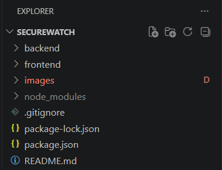
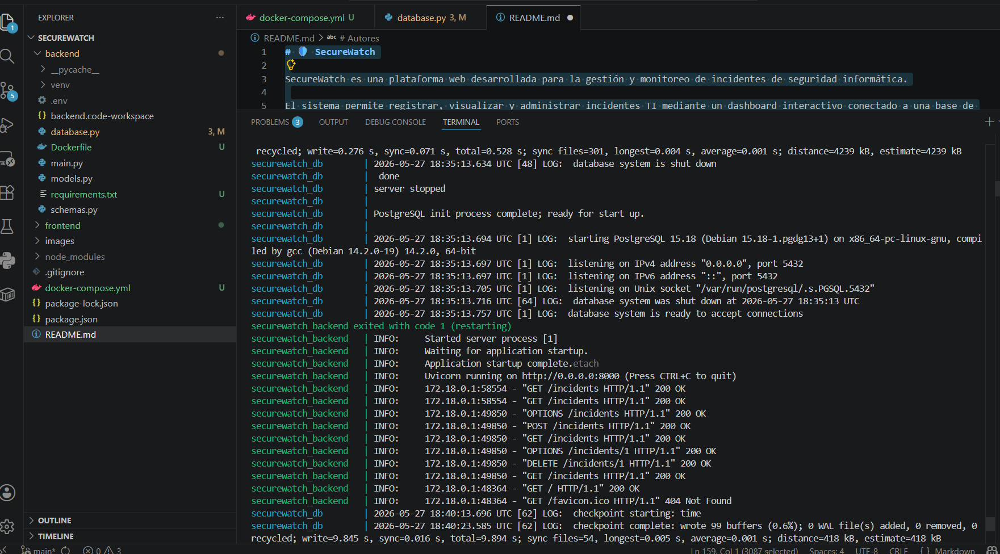

# 🛡️ SecureWatch

SecureWatch es una plataforma web desarrollada para la gestión y monitoreo de incidentes de seguridad informática.

El sistema permite registrar, visualizar y administrar incidentes TI mediante un dashboard interactivo conectado a una base de datos PostgreSQL.

# Tecnologías utilizadas

| Tecnología | Uso |
|---|---|
| React | Desarrollo del frontend |
| FastAPI | Desarrollo del backend |
| PostgreSQL | Base de datos |
| Python | Lógica del backend |
| Recharts | Dashboard y gráficas |
| GitHub | Control de versiones |
| Docker | Contenerización de servicios |
| Docker Compose | Orquestación local de contenedores |

# Funcionalidades

-Registro de incidentes de seguridad TI.

-Visualización de incidentes registrados.

-Clasificación de incidentes por severidad.

-Dashboard interactivo con gráficas.

-Eliminación de incidentes.

-Almacenamiento en base de datos PostgreSQL.

-Comunicación mediante API REST.

-Arquitectura separada en frontend y backend.

-Ejecución mediante Docker y Docker Compose.

# Arquitectura del sistema

El sistema está dividido en tres componentes principales:

Frontend desarrollado en React.
Backend desarrollado con FastAPI.
Base de datos PostgreSQL.

La comunicación entre componentes se realiza mediante una API REST.

# Contenerización con Docker

La aplicación fue contenerizada utilizando Docker y Docker Compose para ejecutar frontend, backend y base de datos en servicios independientes.

# Estructura del proyecto

bash
SecureWatch/
│
├── backend/
│   ├── main.py
│   ├── models.py
│   ├── schemas.py
│   ├── database.py
│   └── venv/
│
├── frontend/
│   ├── src/
│   ├── public/
│   ├── package.json
│   └── vite.config.js
│
├── images/
│   ├── dashboard-main.png
│   └── architecture.png
│
├── .gitignore
└── README.md
├── docker-compose.yml
├── Dockerfile

#  Instalación y ejecución

## 1 Clonar el repositorio

bash
git clone https://github.com/MariaFernandaN2/Proyecto-tendencias.git

## 2 Backend

Ingresar a la carpeta backend:
-cd backend

Activar entorno virtual:
-venv\Scripts\activate

Ejecutar servidor FastAPI:
-uvicorn main:app --reload

## 3 Frontend

Ingresar a la carpeta frontend:
-cd frontend

Instalar dependencias:
-npm install

Ejecutar aplicación React:
-npm run dev

## 4 Acceder al sistema

Frontend:
http://localhost:5173

Backend:
http://127.0.0.1:8000

PostgreSQL → puerto 5432

## 5 Ejecución con Docker

docker compose up --build

#  Estado del proyecto

-Proyecto funcional.

-CRUD completo de incidentes.

-Dashboard interactivo.

-Integración con PostgreSQL.

-API REST con FastAPI.

-Frontend conectado con backend.

-Docker y Docker Compose implementados.

#  Mejoras futuras

-Implementar autenticación de usuarios.
-Agregar despliegue en la nube.
-Incorporar notificaciones automáticas.
-Implementar filtros avanzados.
-Agregar exportación de reportes.

#  Conclusiones

El desarrollo de SecureWatch permitió aplicar conocimientos relacionados con frontend, backend, bases de datos y arquitecturas modernas utilizando tecnologías actuales.

Además, el proyecto permitió comprender la integración entre React, FastAPI y PostgreSQL mediante una arquitectura basada en contenedores y servicios.

#  Autores

Maria Fernanda Gomez Narvaez.
Daniel Alejandro Marulanda Alvarez.
