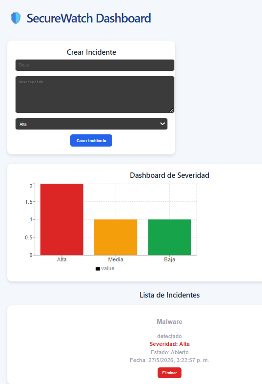

# 🛡️ SecureWatch

SecureWatch es una plataforma web desarrollada para la gestión y monitoreo de incidentes de seguridad informática.

El sistema permite registrar, visualizar y administrar incidentes TI mediante un dashboard interactivo conectado a una base de datos PostgreSQL.

